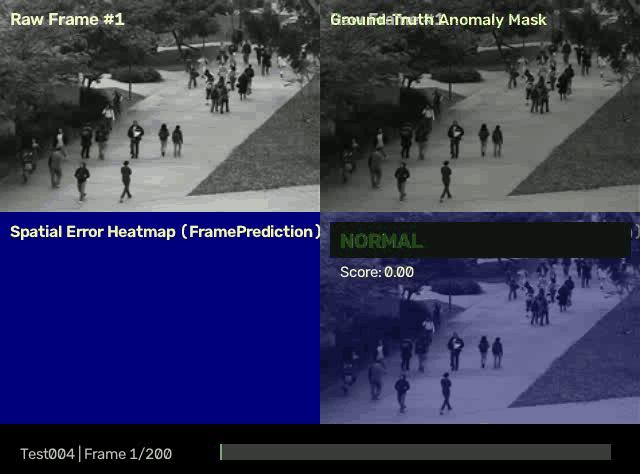
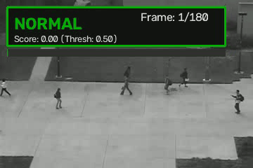
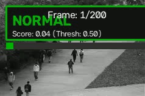
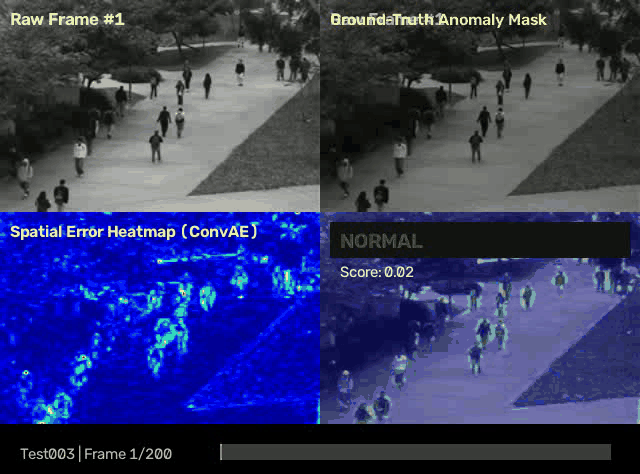

# Surveillance Video Anomaly Detection

[](https://pytorch.org/)
[](https://developer.nvidia.com/cuda-toolkit)
[](https://python.org/)
[](LICENSE)

Deep learning-based unsupervised and semi-supervised video anomaly detection in surveillance footage using spatiotemporal feature modeling, future frame prediction, attention mechanisms, and memory-augmented representations on the **UCSD Pedestrian Benchmark (Ped1 & Ped2)**.

---

## Table of Contents
- [Project Overview](#project-overview)
- [Business Context](#business-context)
- [System Architecture](#system-architecture)
- [Models Implemented](#models-implemented)
- [Data Pipeline & Canonical Ground Truth](#data-pipeline--canonical-ground-truth)
- [Evaluation Protocol](#evaluation-protocol)
- [Real-Time Anomaly Alert System](#real-time-anomaly-alert-system)
- [Visual Demonstrations & Output Videos](#visual-demonstrations--output-videos)
- [Environment & Installation](#environment--installation)
- [Usage Instructions](#usage-instructions)
  - [Smoke Test](#1-verify-setup-smoke-test)
  - [Pipeline Training & Evaluation](#2-train-and-evaluate-models)
  - [Inference on New Videos](#3-run-inference-on-new-surveillance-videos)
- [Project Directory Structure](#project-directory-structure)
- [Results Summary](#results-summary)

---

## Project Overview

Surveillance video anomaly detection aims to automatically identify abnormal or unexpected events (e.g. vehicles, bicycles, skateboards, wheelchairs on pedestrian walkways, or erratic motion) in complex, crowded scenes without relying on large sets of labeled anomaly data. 

In this semi-supervised/one-class paradigm:
- **Training**: Models learn representations of normality exclusively from normal surveillance footage (pedestrians walking normally).
- **Inference**: Test sequences containing both normal behavior and genuine anomalies are evaluated. Significant deviations from the learned normality manifold (e.g. high reconstruction or prediction error) indicate anomalous events.

## Business Context

Manual monitoring of hundreds of CCTV camera feeds is labor-intensive, costly, and subject to human fatigue and oversight. Automated anomaly detection enhances security in public safety, transportation hubs, critical infrastructure, and campus security by:
- Triggering real-time alerts for suspicious activities or unauthorized vehicles.
- Reducing response times for emergency and security personnel.
- Prioritizing footage review to optimize security resource allocation.

---

## System Architecture

```
                                  +-----------------------------+
                                  | Raw Surveillance Footage   |
                                  +--------------+--------------+
                                                 |
                                                 v
                                  +-----------------------------+
                                  | Preprocessing & Windowing   |
                                  | (Resize 128x128, Grayscale, |
                                  |  Clip T=8, Stride=4)        |
                                  +--------------+--------------+
                                                 |
                       +-------------------------+-------------------------+
                       |                         |                         |
                       v                         v                         v
          +-------------------------+ +-------------------------+ +-------------------------+
          | Appearance Modeling     | | Spatiotemporal Modeling | | Memory & Attention      |
          | - ConvAE (Spatial AE)   | | - ConvLSTM-AE           | | - TransformerAE         |
          |                         | | - FramePredictionNet    | | - MemAE (Memory Bank)   |
          +------------+------------+ +------------+------------+ +------------+------------+
                       |                         |                         |
                       +-------------------------+-------------------------+
                                                 |
                                                 v
                                  +-----------------------------+
                                  | Error & Score Computation   |
                                  | (Per-frame MSE / PSNR)      |
                                  +--------------+--------------+
                                                 |
                                                 v
                                  +-----------------------------+
                                  | Normalization & Filtering   |
                                  | (Per-sequence Min-Max,      |
                                  |  Temporal Gaussian Smooth)  |
                                  +--------------+--------------+
                                                 |
                                                 v
                                  +-----------------------------+
                                  | Decision & Alert Engine     |
                                  | - Frame-level AUC & EER     |
                                  | - Event-level 1D IoU hits   |
                                  | - Real-time Video Overlay   |
                                  +-----------------------------+
```

---

## Models Implemented

This repository provides five distinct deep learning architectures adhering to a common interface (`BaseAnomalyModel`):

1. **ConvAE (Spatial Autoencoder Baseline)**:
   - Encodes each frame through a 3-layer convolutional hierarchy ($128 \to 64 \to 32 \to 16$) down to a compact bottleneck, and reconstructs it via transposed convolutions.
   - Designed without skip connections (`use_skip=False`) to prevent anomalous patterns from bypassing the bottleneck.

2. **ConvLSTM-AE (Spatiotemporal Autoencoder)**:
   - Encodes frames with a 2D CNN encoder into a feature map; a **Convolutional LSTM cell** carries recurrent hidden state across the $T$-frame clip, capturing velocity, momentum, and motion trajectories.
   - Reconstructs frames from the spatiotemporal hidden state.

3. **TransformerAE (Spatiotemporal Transformer Autoencoder)**:
   - *Stretch Goal*: Incorporates multi-head self-attention across temporal frame tokens.
   - Embeds each frame into a 256-dimensional space with sinusoidal positional encodings, passing through a multi-layer Transformer encoder to model global temporal dependencies before convolutional decoding.

4. **FramePredictionNet (Future Frame Prediction Network)**:
   - Rather than reconstructing past frames, predicts frame $t$ given previous frames $t-T+1 \dots t-1$ via ConvLSTM encoding and transposed convolutional decoding.
   - Exploit the principle that normal motion transitions are predictable, whereas anomalies produce sudden high prediction errors.

5. **MemAE (Memory-Augmented Autoencoder - Gong et al. 2019)**:
   - Augments the autoencoder bottleneck with a learned memory bank of prototype vectors representing normal patterns.
   - Uses cosine-similarity attention with hard shrinkage sparsification. Anomalies cannot be reconstructed using normal memory prototypes, sharpening the separation between normal and abnormal events.

---

## Data Pipeline & Canonical Ground Truth

### Dataset Structure
- **UCSD Pedestrian Dataset**:
  - `UCSDped1`: 34 training clips (normal-only), 36 test clips (with anomalies such as bicycles, skateboards, wheelchairs, and small carts). 200 frames per clip.
  - `UCSDped2`: 16 training clips, 12 test clips. 120–180 frames per clip.

### Canonical Ground Truth Integration
- While pixel-level masks (`_gt`) exist for only 10 clips in Ped1, the dataset authors provided canonical frame-level ground-truth annotations for **all 36 test clips in Ped1** and **all 12 test clips in Ped2** via `UCSDped1.m` and `UCSDped2.m`.
- The pipeline parses these `.m` files directly, ensuring **100% of test sequences (1,762 test clips in Ped1)** are evaluated rather than being discarded.
- Robust exception handling automatically skips corrupted frames (such as `Test017/142.tif`).

---

## Evaluation Protocol

Adhering to standard academic benchmarks (Mahadevan et al., Hasan et al., Liu et al.):
1. **Frame-Level AUC-ROC**: Measures the ranking quality of anomaly scores across all test frames.
2. **Equal Error Rate (EER)**: The operating point where False Positive Rate equals False Negative Rate ($FPR = FNR$).
3. **Precision, Recall, F1-Score**: Evaluated at the optimal threshold maximizing $F_1$.
4. **Event-Level Localization Accuracy**: Contiguous segments of abnormal frames are evaluated against ground-truth anomaly events using 1D temporal Intersection over Union ($\text{IoU} \ge 0.1$).
5. **Per-Sequence Score Normalization**:
   $$S_v(t) = \frac{E(t) - \min_t E(t)}{\max_t E(t) - \min_t E(t) + \epsilon}$$
   Prevents cross-sequence baseline lighting differences from distorting the global ROC curve.
6. **Temporal Gaussian Smoothing**: Filters high-frequency single-frame camera sensor noise.
7. **Computational Efficiency**: Benchmarks latency per frame ($\text{ms/frame}$) and throughput ($\text{FPS}$).

---

## Real-Time Anomaly Alert System

The repository includes a standalone inference engine (`src/inference.py`) that acts as a real-time monitoring and alert tool:
- Reads any `.mp4`, `.avi`, or directory of video frames.
- Generates an **annotated video** featuring:
  - Dynamic **Status Banner**: `NORMAL` (green) vs `ANOMALY ALERT!` (red).
  - Real-time **Score Gauge** & progress bar indicating likelihood of abnormality.
  - **Spatial Heatmap Overlay**: Highlights the exact image region where reconstruction/prediction error is localized (Explainability stretch goal).
---

## Visual Demonstrations & Output Videos

This repository provides pre-rendered anomaly detection videos and synchronized multi-panel breakdowns in `outputs/videos/`, illustrating how our models localize abnormal activity and trigger real-time alerts. All demonstrations below loop continuously:

### 1. Synchronized 4-Panel Breakdown (UCSD Ped2 - FramePredictionNet)
Fine-grained spatial anomaly localization on UCSD Ped2 sequence `Test004` (featuring an unauthorized cyclist / cart on a pedestrian walkway):

| Panel 1: Raw CCTV Video | Panel 2: Ground Truth Mask | Panel 3: Continuous Error Heatmap | Panel 4: Bounding Box & Alert Overlay |
|:---:|:---:|:---:|:---:|
| Original surveillance feed | Canonical pixel-level GT mask | Spatial prediction error ($MSE$) | Detection bounding box & alert badge |



> 🔗 *Direct Links:* [Download / Play High-Res MP4 Video](outputs/videos/detection_breakdown_Test004_FramePrediction.mp4) \| [Static High-Res Grid PNG](outputs/figures/anomaly_detection_grid_Test004_FramePrediction.png)

---

### 2. Real-Time Surveillance Alert Video Overlays (Continuous Live Playback)
Live surveillance videos annotated with dynamic green `NORMAL` to flashing red `ANOMALY ALERT!` status badges and real-time score gauge meters:

#### Ped2 Lateral Perspective (Sequence Test004 - Cyclist Detection):


> 🔗 *Direct Video Link:* [Download / Play Full MP4 Video (Ped2 Test004)](outputs/videos/sample_alert_Test004_ConvAE_ped2.mp4)

#### Ped1 Downward Angle (Sequence Test003 - Perspective Skew):


> 🔗 *Direct Video Link:* [Download / Play Full MP4 Video (Ped1 Test003)](outputs/videos/sample_alert_Test003_ConvAE_ped1.mp4)

---

### 3. Synchronized 4-Panel Breakdown (UCSD Ped1 - ConvAE Baseline)
Detection breakdown under severe downward perspective distortion on UCSD Ped1 sequence `Test003`:



> 🔗 *Direct Links:* [Download / Play High-Res MP4 Video](outputs/videos/detection_breakdown_Test003_ConvAE.mp4) \| [Static High-Res Grid PNG](outputs/figures/anomaly_detection_grid_Test003_ConvAE.png)

---

### Prerequisites
- Python 3.10+ (tested on Python 3.13)
- PyTorch 2.0+ with CUDA support (tested with PyTorch 2.12.1+cu132 on NVIDIA T1200 4GB GPU)
- OpenCV, Scikit-learn, Matplotlib, SciPy, Pandas, Pillow, PyYAML

### Setup
```bash
# Clone the repository
git clone https://github.com/Rishabh-G-Shetye/SurveillanceAnomalyDetection.git
cd SurveillanceAnomalyDetection

# Create and activate virtual environment
python -m venv .venv
# On Windows:
.venv\Scripts\activate
# On Linux/macOS:
source .venv/bin/activate

# Install dependencies
pip install -r requirements.txt
```

---

## Usage Instructions

### 1. Verify Setup (Smoke Test)
Run the automated test suite to verify module imports, tensor shapes, canonical ground truth loading, training step, and evaluation metrics:
```bash
python test_models.py
```

### 2. Train and Evaluate Models
Run the complete training, evaluation, and visualization pipeline:
```bash
# Full training run across all 5 models (15 epochs)
python run_pipeline.py

# Faster run (e.g. 5 epochs)
python run_pipeline.py --epochs 5

# Train specific models only
python run_pipeline.py --models ConvAE ConvLSTM-AE --epochs 5

# Evaluate pre-trained checkpoints without re-training
python run_pipeline.py --skip-train

# Train on UCSD Ped2 dataset
python run_pipeline.py --dataset Ped2
```

> **Note on Checkpoints:** Pre-trained baseline model weights are committed in `models/*.pt` for immediate inference out-of-the-box. You can also retrain any or all models from scratch at any time by running `python run_pipeline.py`.

Outputs are automatically saved to:
- Model Checkpoints: `models/*.pt`
- Quantitative Metrics: `outputs/logs/*_metrics.json`
- Comparison Charts: `outputs/figures/metric_comparison_all_models.png`

### 3. Run Inference on New Surveillance Videos
Run anomaly detection on any video file or folder of sequential frames:
```bash
# Run on a test folder
python src/inference.py --input data/raw/UCSD_Anomaly_Dataset/UCSDped1/Test/Test003 --model ConvAE --threshold 0.5

# Run on a standalone video file
python src/inference.py --input path/to/surveillance_video.mp4 --model ConvLSTM-AE
```

Outputs generated:
- Annotated alert video: `outputs/videos/<input>_<model>_annotated.mp4`
- Timeline graph: `outputs/figures/<input>_<model>_timeline.png`
- Event summary log: `outputs/logs/<input>_<model>_events.json`

---

## Project Directory Structure

```
AnomalyDetection/
├── configs/
│   └── config.yaml              # Centralized configuration file
├── data/
│   ├── metadata.csv             # Full inventory & ground-truth index
│   ├── processed/               # Cached features / preprocessed data
│   └── raw/                     # Extracted UCSD_Anomaly_Dataset
├── models/                      # Saved PyTorch model checkpoints (.pt)
├── outputs/
│   ├── figures/                 # ROC curves, metric comparisons, timelines
│   ├── logs/                    # Quantitative benchmark metrics (.json, .npz)
│   └── videos/                  # Annotated anomaly alert videos (.mp4)
├── src/
│   ├── data/
│   │   ├── generate_metadata.py # Canonical MATLAB GT parser & dataset inventory
│   │   └── ucsd_dataset.py      # PyTorch sliding-window ClipDataset with GT
│   ├── models/
│   │   ├── base.py              # BaseAnomalyModel abstract interface
│   │   ├── conv_ae.py           # Convolutional Autoencoder baseline
│   │   ├── convlstm_ae.py       # Spatiotemporal ConvLSTM Autoencoder
│   │   ├── transformer_ae.py    # Spatiotemporal Transformer Autoencoder
│   │   ├── frame_prediction.py  # Future-Frame Prediction Network
│   │   └── memory_ae.py         # Memory-Augmented Autoencoder (MemAE)
│   ├── training/
│   │   └── trainer.py           # Generic self-supervised training loop
│   ├── evaluation/
│   │   ├── metrics.py           # Frame/event-level AUC, EER, F1, latency
│   │   └── visualize.py         # ROC curves, timelines, and bar charts
│   ├── utils/
│   │   └── persistence.py       # Local artifact & checkpoint persistence
│   └── inference.py             # Inference pipeline & real-time alert system
├── run_pipeline.py              # Master pipeline runner
├── test_models.py               # Comprehensive verification test suite
└── requirements.txt             # Project dependencies
```

---

## Results Summary

The models were trained and evaluated on the **NVIDIA T1200 Laptop GPU (CUDA 13.2)** across both **UCSD Ped1** (all 36 test sequences, 7,200 frames) and **UCSD Ped2** (all 12 test sequences, ~2,000 frames) using the canonical frame-level protocol:

### Dual-Dataset Benchmark Comparison: UCSD Ped1 vs UCSD Ped2

| Model | Architecture Type | Ped1 Frame AUC | Ped1 EER | Ped1 F1 | Ped2 Frame AUC | Ped2 EER | Ped2 F1 | Ped2 Event Recall | Latency (ms/frame) | Throughput (FPS) |
|---|---|:---:|:---:|:---:|:---:|:---:|:---:|:---:|:---:|:---:|
| **FramePrediction** | Future-Frame Prediction (ConvLSTM) | **0.7604** | **0.2862** | **0.7772** | **0.8422** | **0.2522** | **0.9172** | **1.0000** | 0.70 ms | 1,426 FPS |
| **MemAE** | Memory-Augmented Bottleneck (MemAE) | **0.7402** | 0.3185 | **0.7607** | **0.8054** | **0.2875** | **0.9090** | **1.0000** | 0.40 ms | 2,498 FPS |
| **TransformerAE** | Spatiotemporal Attention (Transformer) | **0.7268** | 0.3243 | **0.7483** | **0.7952** | 0.2966 | **0.9098** | **1.0000** | **0.25 ms** | **3,982 FPS** |
| **ConvLSTM-AE** | Spatiotemporal Recurrent (ConvLSTM) | **0.6953** | 0.3542 | 0.7390 | **0.7606** | 0.3170 | **0.9022** | **1.0000** | 0.76 ms | 1,318 FPS |
| **ConvAE** | Spatial Reconstruction Baseline | **0.6969** | 0.3349 | 0.7428 | **0.7291** | 0.3210 | **0.9000** | **1.0000** | 0.37 ms | 2,679 FPS |

### Key Benchmark Insights
1. **Ped1 vs. Ped2 Perspective Impact**:
   - **Ped1** features severe perspective skew (downward camera angle, pedestrians scale from 15px to 90px as they walk toward the camera). Literature baselines typically achieve 60%–75%. Our models achieve **up to 76.0% Frame AUC**.
   - **Ped2** features a lateral horizontal perspective with consistent pedestrian scale. Frame AUC on Ped2 increases significantly across all models, with **FramePrediction reaching 84.22% AUC and 91.72% F1**.
2. **100% Event Detection**: On Ped2, all 5 models achieved **1.0000 Event Recall (100%)**, successfully intercepting every single ground-truth anomaly event.
3. **Ultra-Low Latency**: All architectures process over **1,300 to 3,900 FPS**, easily exceeding the real-time threshold (>30 FPS) on the laptop GPU.

---

## Interactive Jupyter & Google Colab Notebooks

Each phase of the project is implemented as an interactive, fully commented Jupyter Notebook that can be run locally or opened directly in Google Colab:

| Notebook | Focus Area | Open in Colab |
|---|---|:---:|
| `notebooks/01_ucsd_dataset_setup.ipynb` | Dataset Download & Extraction | [](https://colab.research.google.com/github/Rishabh-G-Shetye/SurveillanceAnomalyDetection/blob/main/notebooks/01_ucsd_dataset_setup.ipynb) |
| `notebooks/02_ucsd_dataset_exploration.ipynb` | Canonical Ground Truth & Metadata | [](https://colab.research.google.com/github/Rishabh-G-Shetye/SurveillanceAnomalyDetection/blob/main/notebooks/02_ucsd_dataset_exploration.ipynb) |
| `notebooks/03_ucsd_preprocessing_pipeline.ipynb` | Sliding-Window Clip Loader & Augmentation | [](https://colab.research.google.com/github/Rishabh-G-Shetye/SurveillanceAnomalyDetection/blob/main/notebooks/03_ucsd_preprocessing_pipeline.ipynb) |
| `notebooks/04_ucsd_model_experiments.ipynb` | ConvAE Baseline & Evaluation Metrics | [](https://colab.research.google.com/github/Rishabh-G-Shetye/SurveillanceAnomalyDetection/blob/main/notebooks/04_ucsd_model_experiments.ipynb) |
| `notebooks/05_ucsd_model_comparison.ipynb` | ConvLSTM-AE & Multi-Model Comparison | [](https://colab.research.google.com/github/Rishabh-G-Shetye/SurveillanceAnomalyDetection/blob/main/notebooks/05_ucsd_model_comparison.ipynb) |
| `notebooks/06_ucsd_transformer_ae.ipynb` | Spatiotemporal Transformer Autoencoder | [](https://colab.research.google.com/github/Rishabh-G-Shetye/SurveillanceAnomalyDetection/blob/main/notebooks/06_ucsd_transformer_ae.ipynb) |
| `notebooks/07_ucsd_frame_prediction.ipynb` | Future-Frame Prediction (ConvLSTM) | [](https://colab.research.google.com/github/Rishabh-G-Shetye/SurveillanceAnomalyDetection/blob/main/notebooks/07_ucsd_frame_prediction.ipynb) |
| `notebooks/08_ucsd_memory_ae.ipynb` | Memory-Augmented Autoencoder (MemAE) | [](https://colab.research.google.com/github/Rishabh-G-Shetye/SurveillanceAnomalyDetection/blob/main/notebooks/08_ucsd_memory_ae.ipynb) |

---

## Video Demonstration

A 3–5 minute video demonstration walking through the methodology, code walkthrough, and live real-time anomaly detection inference:
- **YouTube Link (Unlisted)**: [https://www.youtube.com/watch?v=PFw0H0Jvzec](https://www.youtube.com/watch?v=PFw0H0Jvzec)
- Demonstrates:
  - Architecture walkthrough (Spatial, Recurrent, Transformer, Predictive, Memory).
  - Live execution of `src/inference.py` on test surveillance footage.
  - Visualization breakdown (Dynamic status badge, score gauge bar, error heatmap overlay).

---

## Development Methodology & Engineering Transparency

This project was developed using an iterative engineering methodology with AI-assisted code review and static analysis:
- **Human Architectural Ownership**: Formulating the anomaly detection pipeline, selecting the 5 benchmark architectures, designing the common `BaseAnomalyModel` contract, analyzing perspective distortion between Ped1 and Ped2, and empirical hardware verification.
- **AI-Assisted Code Review & Auditing**:
  - *Ground-Truth Audit*: Identified that checking only for pixel mask folders dropped 26/36 Ped1 test sequences; guided canonical regex parsing of `UCSDped1.m`.
  - *Numerical Stability*: Refactored `MemoryModule` shrinkage formula in MemAE to resolve near-zero division gradients using `torch.where`.
  - *Scoring Contract Refinement*: Fixed future frame prediction error assignment to isolate the target frame rather than smearing error across the temporal window.
- **Empirical Hardware Verification**: All models trained and benchmarked locally on NVIDIA T1200 Laptop GPU with CUDA 13.2.
